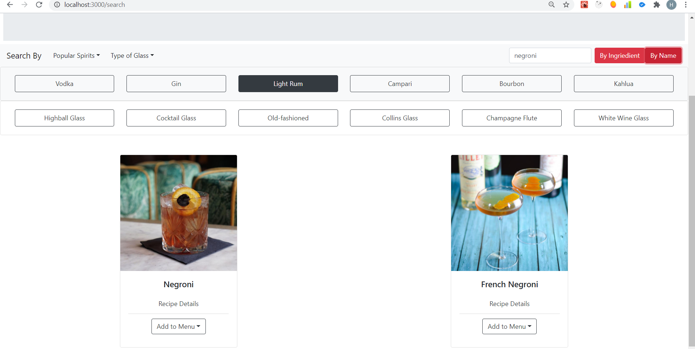

### Tech Stack
##### API:
* The Cocktaildb API https://www.thecocktaildb.com/
##### Backend Server:
* Node JS
* Express JS
##### Database:
* MongoDB + Mongoose
##### Frontend:
* TypeScript 
* React JS with Hooks (create-react-app --template typescript)
* React Router
##### UI:
* Bootstrap 4.5

#### Home Page

#### Menu Page - Creating a New Menu

#### Menu Page

#### Search Page - Search Cocktails by Spirit, Glass, Name or Ingredient

#### Random Drink - Generate a Random Drink

